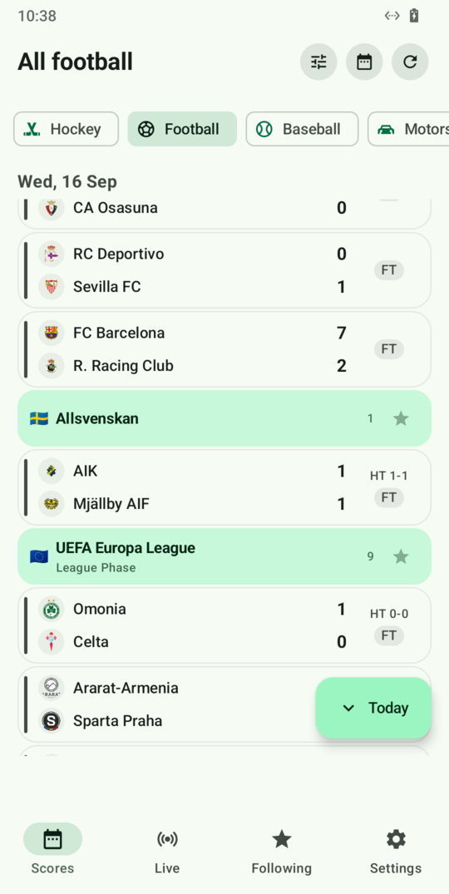
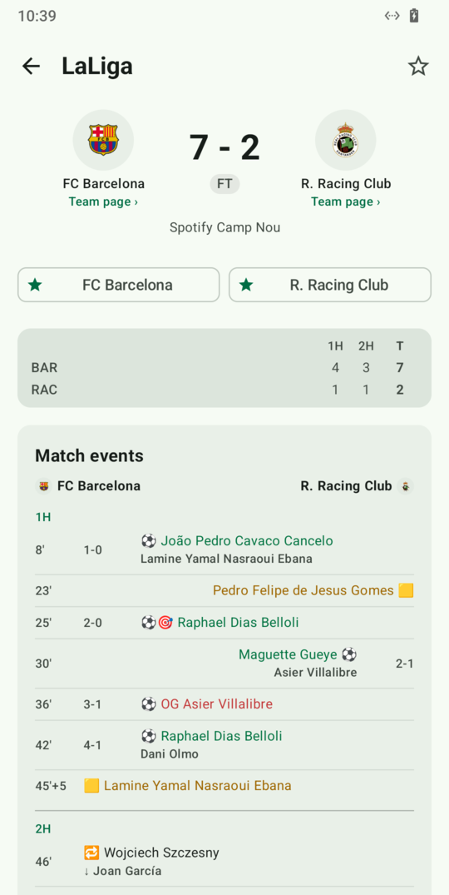
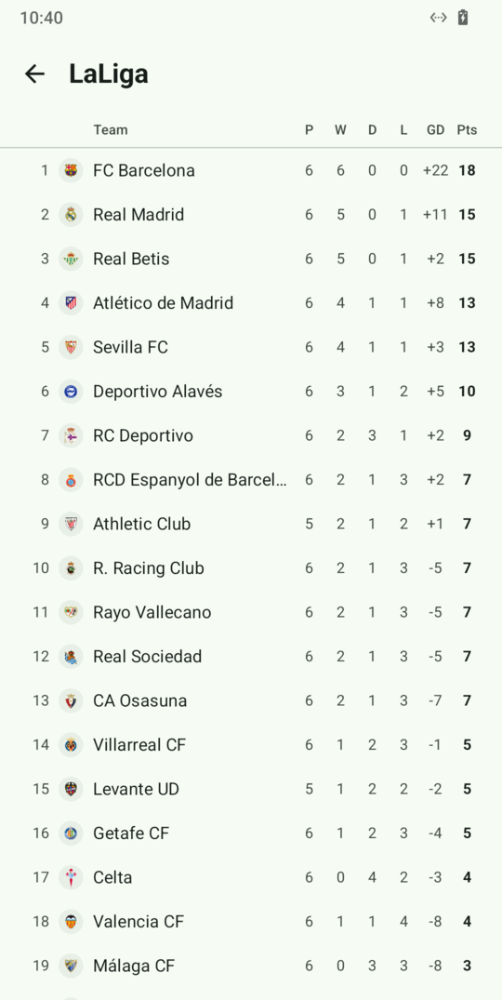
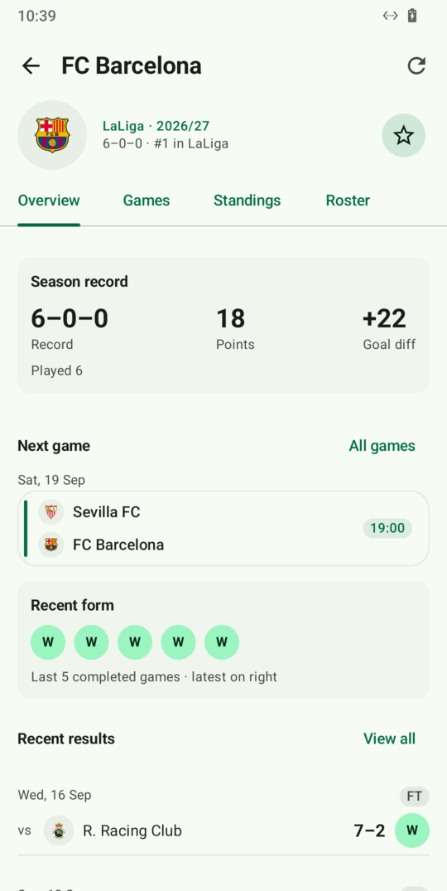

# OpenScore

**Open-source live sports tracking built only on public, key-less APIs.**

OpenScore maps the unofficial JSON APIs that sports leagues expose to power their own
websites and apps, documents them so anyone can use them, and wraps them in a shared
Kotlin Multiplatform core that apps are built on — an Android app today; desktop and web
are a build-file change.

No API keys. No accounts. No paid data providers. No analytics.

<p align="center">
  
  
  
  
</p>

## What's here

- **28 leagues in core**: 7 hockey, 2 floorball, 17 football, 1 baseball, 1 MMA (the UFC),
  plus Formula 1 on a small racing surface of its own. Their APIs live under
  [`apis/`](apis) with exact requests, captured responses and a health check per supported
  endpoint.
- [`core/`](core/README.md): one sport-agnostic model and a provider per league, sharing a
  polite HTTP layer, a club crosswalk that links the same club across competitions, team
  pages, and durable stores an app can plug in. Every provider is replay-tested against the
  checked-in samples.
- [`apps/android`](apps/android/README.md): a Compose app over `core/` that talks to the
  leagues directly: day timeline, Live and Following feeds, match pages with lineups, stats
  and events, league tables, one page per club, UFC fight cards with results and scorecards,
  an F1 season view, offline scores, and notifications without any push service.
- [`apps/feed-server`](apps/feed-server/README.md): the same data as one JSON contract,
  [Feed v1](docs/feed-v1.md), over HTTP and SSE — also the proxy a browser app needs for
  the feeds without CORS.
- [`tools/api-health`](tools/api-health/README.md): re-requests every documented endpoint
  and diffs its shape against the sample; [runs weekly](.github/workflows/api-health.yml).
  [`tools/live-capture`](tools/live-capture/README.md) records a game tick by tick for the
  live-state samples.

## League coverage

| Sport | League | Doc | Core | Notes |
|---|---|---|---|---|
| Hockey | NHL | [apis/hockey/nhl](apis/hockey/nhl/README.md) | `nhl` | api-web.nhle.com. Play-by-play with coordinates, positional lineups. No CORS (proxy for web). |
| Hockey | Liiga (FIN) | [apis/hockey/liiga](apis/hockey/liiga/README.md) | `liiga` | CORS open. No running flag on the clock. |
| Hockey | SHL (SWE) | [apis/hockey/shl](apis/hockey/shl/README.md) | `shl` | Sportality platform. Live over its SSE stream, REST snapshot at every connect. |
| Hockey | HockeyAllsvenskan (SWE) | [apis/hockey/hockeyallsvenskan](apis/hockey/hockeyallsvenskan/README.md) | `hockeyallsvenskan` | The site has no day route: the season is read from the match page and kept as a normalized snapshot; due and live games are re-read one by one. Schedule, results, period scores, lineups (lines and pairings from the game page), the league table, club pages, squads, player profiles and the play-by-play timeline. Four of those answer only a POST, which is a read here and nothing else; the MQTT push is mapped and not wired. |
| Hockey | CHL (Champions Hockey League) | [apis/hockey/chl](apis/hockey/chl/README.md) | `chl` | Static JSON files on S3. No shots. |
| Hockey | KHL | [apis/hockey/khl](apis/hockey/khl/README.md) | `khl` | Via the official mobile-app API (webcaster.pro), CORS open. khl.ru itself is geo-blocked — out of scope. |
| Hockey | DEL (GER) | [apis/hockey/del](apis/hockey/del/README.md) | `del` | The official app's backend (one `query.php` on appticore.com, key-less, no CORS, nothing edge-cached). Day windows in UTC, events with strength and assists, shots with coordinates, lines and pairings, standings, rosters. Live states not yet observed. |
| Floorball | SSL Herr (SWE) | [apis/floorball/ssl](apis/floorball/ssl/README.md) | `ssl` | The same Sportality platform as the SHL, with IBIS statistics: schedule, results, standings, teams, rosters, players and post-game totals. The shared game-day routes return no floorball data at all (empty bodies, or `500`), so there are no events, lineups or clock, and live states await an in-play capture. |
| Floorball | F-Liiga Men (FIN) | [apis/floorball/f-liiga](apis/floorball/f-liiga/README.md) | `f-liiga` | The league's own key-less WordPress proxy over TorneoPal. The whole season's fixtures come from the match records in a few kilobytes; one document per match carries lineups with lines, events with rink coordinates and period scores. Live WebSocket located but not yet captured in play. The origin's Imunify360 bot protection challenges a client it reads as automating, across the whole domain: the machine that maps and health-checks the feed earns it, an ordinary device does not, and it expires by itself. Passing the challenge would need its JavaScript and cookie, so it stays out of scope and the feed server is the way around it. |
| Floorball | Allsvenskan Herr (SWE) | [access audit](apis/floorball/ssl/README.md#out-of-scope-allsvenskan-on-statsinnebandyse) | ⛔ | stats.innebandy.se exchanges for a short-lived Bearer token; the supported iBIS API requires credentials and a paid agreement. |
| Floorball | Lidl Unihockey Prime League Men (SUI) | [access audit](apis/floorball/swiss-prime-league/README.md) | ⛔ | The web data API requires a member Bearer token; the Android alternative relies on a private packaged app credential. Legacy key-less routes expose only a table and isolated team headers, with no schedule or game-id discovery path. |
| Baseball | MLB | [apis/baseball/mlb](apis/baseball/mlb/README.md) | `mlb` | statsapi.mlb.com. Every live state sampled; per-pitch data, JSON-Patch diff feed, `fields=` trimming. Team pages with schedule, roster and season stats. |
| Football | Premier League (ENG) | [apis/football/premier-league](apis/football/premier-league/README.md) | `premier-league` | Pulselive API behind premierleague.com. CORS open, kick-offs in local time. |
| Football | EFL — Championship · Carabao Cup (ENG) | [apis/football/efl](apis/football/efl/README.md) | `championship`, `carabao-cup` | EFL Digital's Gamechanger API behind efl.com (also serves League One, League Two, EFL Trophy). One document per match with lineups and events, CORS open, nothing edge-cached. Key-less Firestore push documented, still polled. In-play states pending. |
| Football | Malta Premier (MLT) | [apis/football/malta-premier](apis/football/malta-premier/README.md) | `malta-premier` | MFA match centre over COMET. Minute-level events; no match stats or reliable squads. |
| Football | Serie A (ITA) | [apis/football/serie-a](apis/football/serie-a/README.md) | `serie-a` | Deltatre API behind legaseriea.it. 40 s edge cache. |
| Football | Bundesliga (GER) | [apis/football/bundesliga](apis/football/bundesliga/README.md) | `bundesliga` | Public Firebase Realtime Database behind bundesliga.com (also 2. Bundesliga, DFB-Pokal). All live states sampled, SSE push verified. xG per goal. Squads come from ESPN (the DFL's own are key-gated). |
| Football | Ligue 1 (FRA) | [apis/football/ligue-1](apis/football/ligue-1/README.md) | `ligue1` | REST API behind ligue1.com (also Ligue 2, Coupe de France). Complete live series sampled; second-precision period timestamps, live standings, xG. |
| Football | LaLiga (ESP) | [apis/football/la-liga](apis/football/la-liga/README.md) | `la-liga` | LaLiga's own API behind laliga.com (also Hypermotion, Copa del Rey). Needs a public page-embedded key — the documented exception in [principles.md](docs/principles.md#nothing-private). Second-precision timestamps, 137 team stats. |
| Football | Allsvenskan (SWE) | [apis/football/allsvenskan](apis/football/allsvenskan/README.md) | tables, teams, squads, players for `allsvenskan`, `superettan` | Key-less GraphQL (`gql.sportomedia.se`) behind allsvenskan.se, with open introspection. Live-tested and found too flaky for scores (429s, frozen clock), so games come from Fogis below. |
| Football | Sweden — Allsvenskan, Superettan, Svenska Cupen (+ every tier) | [apis/football/fogis-livescore](apis/football/fogis-livescore/README.md) | `allsvenskan`, `superettan`, `svenska-cupen` + the `fogis` umbrella | The FA's Fogis livescore XML behind svenskfotboll.se: every SvFF competition. `User-Agent` required, local times, mm:ss event clock, half-time scores, per-player lineup stats. No standings (those come from allsvenskan.se). |
| Football | UEFA Champions League · Europa League · Conference League · Nations League | [apis/football/uefa](apis/football/uefa/README.md) | `ucl`, `uel`, `uecl`, `unl` | uefa.com's key-less micro-services - one API for every UEFA competition. No CORS for third parties, second-precision phase timestamps, events with coordinates, and a `livescore` change detector that costs ~300 B on a quiet day. Every in-play state sampled across a whole Nations League matchday (extra time and penalties still only seen after the fact). Squads come from ESPN (UEFA has none). The Nations League is national sides, four tiers of groups and a biennial calendar, so it has no club crosswalk and no squads. |
| Football | Major League Soccer (USA/CAN) | [apis/football/mls](apis/football/mls/README.md) | `mls` | MLS's own `stats-api` plus `sportapi` for pre-game metadata. Data routes are `no-store` (honoured). No live capability until a live sample is captured. |
| Football | ESPN (squads only) | [apis/football/espn](apis/football/espn/README.md) | `EspnRosters` | Not a league: the one ESPN route adopted, `…/teams/{id}/roster`, supplies squads for the Bundesliga and the three UEFA competitions behind hand-verified ids in the club crosswalk. |
| Motorsport | Formula 1 | — | `f1` (`RacingProvider`) | [Jolpica F1](https://github.com/jolpica/jolpica-f1), the open-source, Ergast-compatible F1 API (see [Acknowledgements](#acknowledgements)): calendar with sessions, race / qualifying / sprint classifications, driver and constructor tables. No live timing. Not yet mapped under `apis/`. |
| MMA | UFC (+ Contender Series, Road to UFC) | [apis/mma/ufc](apis/mma/ufc/README.md) | `ufc` | The key-less live-stats JSON behind ufc.com's event pages (CloudFront). One document per card with results, scorecards and a tracked timeline; per-fight strike/takedown stats. No listing route — cards are discovered by sweeping the dense id space and kept as a snapshot. Live states pending. |
| Football | NFL | — | ⛔ | No key-less league API (`api.nfl.com` needs credentials). |

**Core** = the league id(s) a `LeagueProvider` in `core/` serves · ⛔ no usable key-less API. Which live states each league has been sampled in is in its README;
the weekly [API health](.github/workflows/api-health.yml) run says whether an endpoint is broken.

## Principles

1. **Key-less only.** If an API needs a token, key, login or paid plan, it is out of scope.
2. **Verified, not assumed.** Every documented endpoint has been called for real and has a
   captured sample response next to it, with a "last verified" date. Those samples are what
   the provider tests replay and what the health checks compare against.
3. **Be a good citizen.** These are unofficial APIs. We identify ourselves with a descriptive
   `User-Agent`, respect cache headers, poll live games no faster than every 10 seconds, ask
   only for what the screen can show, and never hammer endpoints.
4. **One source per league, explicit provenance.** A league's own API is its source. A second
   source is adopted only for a league we do not have or a capability the primary feed
   demonstrably lacks, and only after it has been mapped, health-checked and tested like any
   other feed. Ids are never joined by name; clubs are linked across leagues through a
   hand-curated crosswalk.
5. **Sport-agnostic core.** One data model for hockey, football, baseball and MMA; a new
   league is a new provider, not a rewrite. Racing, which has no two-team game, gets its own
   small surface rather than a forced fit.

The full contract is [docs/principles.md](docs/principles.md); the model is
[docs/data-model.md](docs/data-model.md).

## Repository layout

```
apis/                One folder per feed: README.md + health.json + samples; blocked audits may be README-only
  hockey/            nhl  liiga  shl  hockeyallsvenskan  chl  khl  del
  football/          premier-league  efl  malta-premier  serie-a  bundesliga  ligue-1  la-liga
                     allsvenskan  fogis-livescore  uefa  mls  espn
  floorball/         ssl  f-liiga  swiss-prime-league (access audit)
  baseball/          mlb
  mma/               ufc
docs/                principles (how we treat the APIs), data-model, the Feed v1 contract, screenshots
core/                Kotlin Multiplatform library: model, providers, HTTP layer, club crosswalk, stores, Feed v1 mapper
apps/android/        The Android app: Jetpack Compose over core/, no server in between
apps/feed-server/    Ktor server exposing Feed v1 (REST + SSE); --offline serves the samples
tools/api-health/    CLI that re-requests every documented endpoint and diffs its shape against the sample
tools/live-capture/  Polls a game through its provider and keeps raw bodies + mapped state per tick
.github/workflows/   The weekly API health run
```

## Building

Requires JDK 21 and, for the Android modules, an Android SDK with platform 37
(`ANDROID_HOME`, or `sdk.dir=…` in a git-ignored `local.properties`).

```
./gradlew check                                         # compiles everything, runs every sample-backed test
./gradlew :apps:android:assembleDebug                   # the app, apps/android/build/outputs/apk/debug/
./gradlew :apps:feed-server:run --args="--offline"      # Feed v1 on :8080 from the checked-in samples, no network
./gradlew :tools:api-health:run --args="--league nhl"   # real requests against one league
```

## Contributing

Want to map a league, fix a broken endpoint, or build an app on the core? See
[CONTRIBUTING.md](CONTRIBUTING.md) — it says what a finished contribution looks like and
leaves how you get there to you.

## Acknowledgements

- **Formula 1 data comes from [Jolpica F1](https://github.com/jolpica/jolpica-f1)**
  (`api.jolpi.ca`, Apache-2.0) — an open-source, community-run API that took over from the
  Ergast API. Unlike every other feed here it is not a league's own site but a project run by
  volunteers on their own hosting; if you use OpenScore for F1, consider
  [supporting them](https://github.com/jolpica/jolpica-f1#readme). OpenScore stays well inside
  their published limits (4 requests/s burst, 500/hour): every Jolpica response is cached for
  a day.
- The ESPN roster route was found through the community's
  [Public-ESPN-API](https://github.com/pseudo-r/Public-ESPN-API) documentation.

## Disclaimer

OpenScore is not affiliated with or endorsed by any league. The APIs documented here are
unofficial, undocumented by their owners, and may change or disappear without notice. Some
leagues' terms of service restrict automated access; you are responsible for how you use
this information.

## License

Copyright © 2026 OpenScore contributors.

OpenScore is free software: you can redistribute it and/or modify it under the terms of the
[GNU General Public License](LICENSE) as published by the Free Software Foundation, either
version 3 of the License, or (at your option) any later version. It is distributed in the
hope that it will be useful, but **without any warranty**; see the licence for details.

The captured API responses under `apis/**/samples/` are reproduced for documentation and
testing; the underlying data belongs to the leagues and their data providers.
